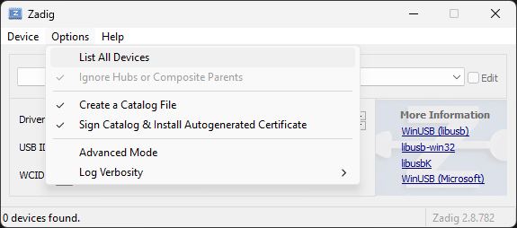
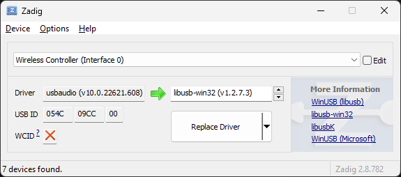

# ds4-tools

This repo contains some Python scripts I use to play and reverse-engineer the
DualShock 4 controller.

## Warning

Use these files at your own risk and be ready to throw away your controller
because it could stop working.

They have been tested on **only two DS4** on planet Earth, so any slight change
of your DS4 w.r.t mine can lead to bricking it.

## Contents

- `ds4-tool.py` can be used to play with undocumented commands of your DualShock 4
- `ds4-calibration-tool.py` can be used to calibrate analog sticks or triggers. It has a nice TUI.

## How to use them

1. Clone the repo and go into the directory
```
$ git clone <repo link>
$ cd ds4-tools
```

2. Install dependencies
```
$ virtualenv venv
$ . venv/bin/activate
$ pip install -r requirements.txt
```

3. Play with the scripts
```
$ python3 script.py
```

## Example

```
$ python3 ds4-tool.py info

[+] Waiting for device VendorId=054c ProductId=09cc
Compiled at: Sep 21 2018 04:50:51
hw_ver:0100.b400
sw_ver:00000001.a00a sw_series:2010
code size:0002a000

```

## DS4 Calibration

If you are here, there are good probabilities you want to recalibrate your DS4.
In that case, the script for you is `ds4-calibration-tool.py`.

The DS4 by default will undo changes after a reset or after it goes in standby.
This is good to test calibration and see if the result is good enough for you
without messing everything up.

At some point you may want to make changes permanent. To do that, you
should change the flash-mirror status using ds4-tool. 
I suggest to switch back to temporary right after the calibration is done.

Here it follows an example:
```
# 1. Know if changes are temporary or permanent (0: permanent; 1: temporary)
$ ./ds4-tool.py get-flash-mirror-status 

# 2. Change flash mirror behavior to permanent
$ ./ds4-tool.py set-flash-mirror-status 0

# 3. Do calibration here
$ ./ds4-calibration-tool.py

# 4. Change flash mirror behavior back to temporary
$ ./ds4-tool.py set-flash-mirror-status 1
```

## Notes for Windows

The tools won't detect your DualShock 4 until you change default driver to the libusb one.

The easiest way to do this is to use the [Zadig](https://zadig.akeo.ie/ "Zadig's Homepage") software.

1. Download and run Zadig

2. Open `Options` menu and check `List All Devices` item


3. Select your DualShock 4 from list and change the driver to libusb-win32 one
  * `Wireless Controller` [054c:05c4] for the 1st revision
  
  * `Wireless Controller (Interface 0)` [054c:09cc:00] for the 2nd revision
  

4. Press `Replace Driver` button and agree with every other question (if any)

## Notes for Mac OS X

If you get `usb.core.NoBackendError: No backend available` error, you should
install `libusb`.

Using Homebrew you can install all required tools with this command:

```
$ brew install git python virtualenv libusb
```
